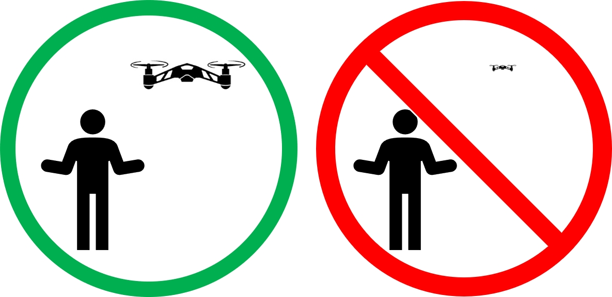

# (PART\*) Safety {-}

# Safety Guidelines {- #safety}

Drone flight safety beings with planning - lots of things can go wrong, but if you're prepared, you can mitigate issues.

In this page, we'll introduce some of the basic drone rules.  Basically, the rules for operating a drone can be boiled down to **"Do not do anything unsafe"** - but sometimes they have to be spelled out.

## General Safety {-}

Here are the 7 general safety rules for the (ref:UCCBOlong).

1. **Only fly in safe locations**

    A safe location is 
    
    This means
    
    * No one is allowed
    * Make sure no one is able to enter the flying
       
    We recommend utilizing one of the designated flying sites at each of the campuses. Please make sure to abide by each site's operating instructions.
       
2. **No flying carelessly or recklessly**

    Example text

3. **All flights must be documented**   

    All UAS operations must be filed with the UC Drones Web App. Recurrent coursework, academic or club use may utilize the Project. Individual recreational/one-off use should utilize the individual flight request. All UAS operations must submit post-flight documentation. All UAS operations on UC property must be approved by the facility manager of the property. All UAS flight operations under this guidance may only occur in pre-approved flying-site locations.

## Pilot Safety {-}

The pilot is an important part of ensuring a safe flight activity.  Under the UC Drone Academic Program, you must abide by these rules:

1. **All pilots must be fit for flight**

    No drinking, no fighting. No one may manipulate the flight controls of a UAS
    
    - within 8 hours after the consumption of any alcoholic beverage; 
    - while under the influence of alcohol or any drug that affects one's faculties in any way contrary to safety; or 
    - if he or she knows or has reason to know that he or she has a physical or mental condition that would interfere with the safe operation of the UAS
    
    Use the IMSAFE mnemonic 
    
2. **Anyone participating in a flight activity must be trained**

    No one should be thrown into an activity they are not familiar with
    
3. **The pilot in command is responsible for the safety of the flight** 

    The RPIC must at all times be physically close enough to the flight controls and the person manipulating the flight controls in order to assume control.
    
    The Remote Pilot in Command must be designated before and during the flight of the unmanned aircraft. The Remote Pilot in Command is directly responsible for and is the final authority as to the operation of the UAS. The Remote Pilot in Command is responsible for ensuring that the UAS will pose no undue hazard to other people, other aircraft or other property in the event of a loss of control of the aircraft for any reason. The Remote Pilot in Command must ensure that the UAS operation complies with all applicable regulations and policy. The Remote Pilot in Command must have the ability to direct the UAS to ensure compliance with all applicable regulations and policy

4. **The drone must always be within visual line of sight**

    No flying farther than you can clearly see the drone. You must be able to see the drone at all times.

